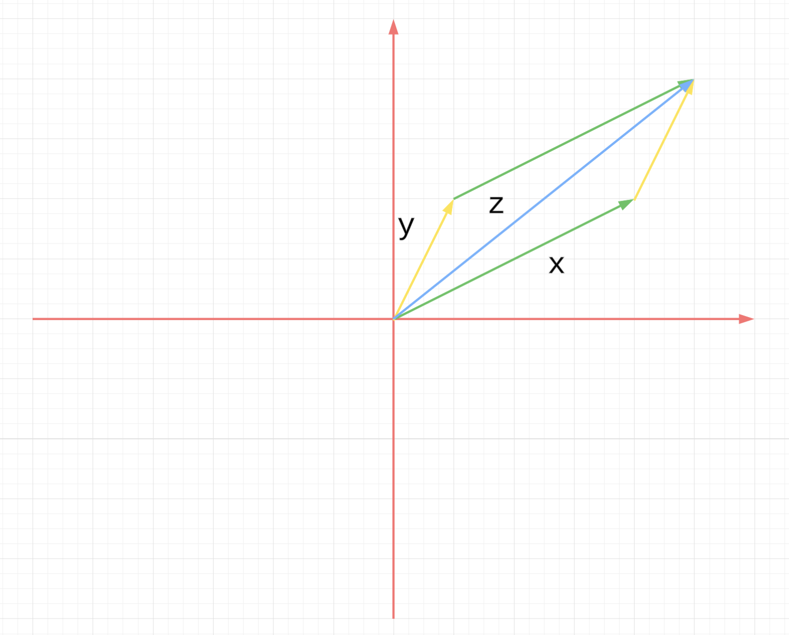

# Chapter 2 Euclidean Space

## 2.1 Algebra: Vectors

### 2.1.1.

Write down any three specific nonzero vectors $u$, $v$, $w$ from 
$\mathbb{R}^3$ and any two specific nonzero scalars $a, b$ from
$\mathbb{R}$. 
Compute $u+v, aw, b(v+w), (a+b)u$,
$u+v +w, abw$, and the additive inverse to $u$.

**Solution**:

Let
$$ 
u = (1,0,0) \\
v = (0,1,0) \\
w = (0,0,1) \\
a = 1, b = -1 \\
u + v = (1, 1, 0) \\
aw = w = (0,0,1) \\
b(v + w) = (0,-1,-1) \\
(a+b)u = 0 \\
u+v+w = (1,1,1) \\
ab(w) = (0,0,-1) \\
$$

### 2.1.2.

Working in $\mathbb{R}^2$, give a geometric proof that if we view 
the vectors $x$ and $y$ as arrows from $0$ and form the 
parallelogram $P$ with these arrows as
two of its sides, then the diagonal $z$ starting at $0$ is the vector sum $x + y$ viewed as an arrow.

**Proof**:

See the figure below.

### 2.1.3.

Verify that $\mathbb{R}^n$ satisfies vector space axioms (A2), (A3), (D1).

**Proof**:

(A2) $0$ is an additive identity

$$ 
0 + x = (0, \cdots, 0) + (x_1, \cdots, x_n) \\
= (0 + x_1, \cdots, 0 + x_n) \\
= (x_1, \cdots, x_n) \\
= x
$$

$\square$

(A3) Existence of additive inverses

Let $x = (x_1, \cdots, x_n)$ and $y = (-x_1, \cdots, -x_n)$

$$ 
y + x = (-x_1 + x_1, \cdots, -x_n + x_n) \\
= (0, \cdots, 0)
$$

So $y$ is the additive inverse of $x$.

$\square$

(D1) Scalar multiplication distributes over scalar addition

$$ 
(a+b)x =
(a+b) (x_1, \cdots, x_n) \\
= ((a+b)x_1, \cdots, (a+b)x_n) \\
= (ax_1 + bx_1, \cdots, ax_n + bx_n) \\
= (ax_1, \cdots, ax_n) + (bx_1, \cdots, bx_n) \\
= ax + bx
$$

$\square$

### 2.1.4.

Are all the field axioms used in verifying that Euclidean space 
satisfies the vector space axioms?

**Solution**: Let's check the vector space axioms one by one.

(A1) Addition is associative uses (Fa1)

(A2) 0 is an additive identity uses (Fa2)

(A3) Existence of additive inverses (Fa3)

(A4) Addition is commutative (Fa4)

(M1) Scalar multiplication is associative (Fm1)

(M2) 1 is a multiplicative identity (Fm2)

(D1) Scalar multiplication distributes over scalar addition (Fd1)

(D2) Scalar multiplication distributes over vector addition (Fd1)

So we can see (Fm3) and (Fm4) are not used.

$\square$

### 2.1.5.

Show that $0$ is the unique additive identity in $\mathbb{R}^n$.
Show that each vector $x ∈ \mathbb{R}^n$ has a unique additive 
inverse, which can therefore be denoted $−x$.
(And it follows that vector subtraction can now be defined,

$$ 
- : \mathbb{R}^n \times \mathbb{R}^n \rightarrow \mathbb{R}^n,
\quad x - y = x + (-y)
$$

for all $x, y \in \mathbb{R}^n$.

Show that $0x = 0$ for all $x ∈ \mathbb{R}^n$.

**Proof**:

Assume $x = (x_1, \cdots, x_n)$ is a additive identity and
$y = (y_1, \cdots, y_n) \in \mathbb{R}^n$. Then
$x + y = y$, i.e.

$$ 
x_1 + y_1 = y_1, \cdots , x_n + y_n = y_n
$$

So $x_1 = \cdots = x_n = 0$, so $x = 0$.
And thus $0$ is unique.

Assume $x = (x_1, \cdots, x_n)$ and
$y (y_1, \cdots, y_n) \in \mathbb{R}^n$ is $x$'s additive inverse.

$$ 
x + y = (x_1 + y_1, \cdots, x_n + y_n) = 0
$$

So

$$ 
y = (-x_1, \cdots, -x_n)
$$

The additive inverse is unique.

$$ 
0x = 0 (x_1, \cdots, x_n) = (0x_1, \cdots, 0x_n) =
(0, \cdots, 0)
$$

$\square$

### 2.1.6.

Repeat the previous exercise, but with $\mathbb{R}^n$ replaced by 
an arbitrary vector space $V$ over a field $F$. (Work with the axioms.)

$$ 
0 = 0' + 0 = 0 + 0' = 0'
$$

So $0$ is unique.

$$ 
y = y + 0 = y + (x + y') = (y + x) + y' = 0 + y' = y'
$$

So the additive inverse is unique.

$$ 
0x + 1x = (0 + 1) x = 1 x = x
$$

Then we can add $-x$ on both side

$$ 
0x + x + (-x) = 0x \\
\Rightarrow \\
x + (-x) = 0 \\
\Rightarrow \\
0x = 0
$$

$\square$

### 2.1.7.

Show the uniqueness of the additive identity and the additive 
inverse using only (A1), (A2), (A3). (This is tricky; the opening 
pages of some books on group theory will help.)

**Proof**:

I cannot figure it for now.

The uniqueness of the additive identity. Assume
$0$ and $0'$ are 2 additive identities.
Then

$$ 
0' + 0 = 0  \\
0 + 0' = 0' \\
0' + 0' = 0' \\
$$

### 2.1.8.

Let $x$ and $y$ be noncollinear vectors in $\mathbb{R}^3$. Give a geometric description of the set of all linear combinations of $x$ and $y$.

**Solution**: All the linear combinations of $x$ and $y$ form a plane that
includes $0, x, y$.

$\square$

### 2.1.9

Which of the following sets are bases of $\mathbb{R}^3$?

$$
S_1 = \{(1,0,0),(1,1,0),(1,1,1)\} \\
S_2 = \{(1,0,0),(0,1,0),(0,0,1),(1,1,1)\} \\
S_3 = \{(1,1,0),(0,1,1)\} \\
S_4 = \{(1,1,0),(0,1,1),(1,0,-1)\} \\
$$

How many elements do you think a basis for $\mathbb{R}^n$ must have? Give (without
proof) geometric descriptions of all bases of $\mathbb{R}^2$, of $\mathbb{R}^3$.

**Solution**:

For $S_1$, given $(x,y,z)$, we have

$$ 
\begin{cases}
    x &= a + b + c\\
    y &= b + c \\
    z &= c \\
\end{cases} 
$$

Then we can have

$$ 
\begin{cases}
    a = x - y\\
    b = y - z\\
    c = z\\
\end{cases}
$$

So $S_1$ is a base.

For $S_2$, it is note a base. For example
$(1,1,1)$ can be expressed by multiple ways.

For $S_3$

$$ 
\begin{cases}
    x &= a \\
    y &= a + b \\
    z &= b \\
\end{cases} 
$$

Then we cannot represent $(1,3,1)$ with $S_3$.

For $S_4$,

We have

$$ 
\begin{cases}
    x &= a + c\\
    y &= a + b \\
    z &= b - c\\
\end{cases}
$$

Then we have to have $z = y - x$, so
we cannot represent $(1,1,1)$ with $S_4$.

For $\mathbb{R}^n$, it needs $n$ element for a basis.

For $\mathbb{R}^2$, if $\{f_1, f_2\}$ is a basis, then geometrically, they
should not be in one line.

For $\mathbb{R}^3$, if $\{f_1, f_2, f_3\}$ is a basis, then geometrically, they
should not be in the same plane.

$\square$

### 2.1.10.

Recall the field $\mathbb{C}$ of complex numbers. Define complex $n$-space $\mathbb{C}^n$ analogously to $\mathbb{R}^n$:

$$ 
\mathbb{C}^n =
\{
(z_1, \cdots, z_n) : z_i \in \mathbb{C} \text{ for }
i = 1, \cdots, n
\}
$$

and endow it with addition and scalar multiplication defined by 
the same formulas as for $\mathbb{R}^n$. You may take for granted 
that under these definitions, $\mathbb{C}^n$ satisfies the vector 
space axioms with scalar multiplication by scalars from
$\mathbb{R}$, and also $\mathbb{C}^n$ satisfies the vector space 
axioms with scalar multiplication by
scalars from $\mathbb{C}$. That is, using language that was 
introduced briefly in this section, $\mathbb{C}^n$ can be viewed 
as a vector space over $\mathbb{R}$ and also, separately, as a
vector space over $\mathbb{C}$. Give a basis for each of these 
vector spaces.

**Solution**:

For the first one

$$ 
S_1 = \{
(1,\cdots,0),
(i,\cdots,0),
\cdots 
(0,\cdots,1),
(0,\cdots,i)
\}
$$

For the second one

$$ 
S_2 = \{
(1,\cdots,0),
\cdots 
(0,\cdots,1)
\}
$$

$\square$

## 2.2 Geometry: Length and Angle

### 2.2.1

Let

$$ 
x = (\frac{\sqrt[]{3}}{2}, -\frac{1}{2}, 0),
y = (\frac{1}{2}, \frac{\sqrt[]{3}}{2}, 1),
z = (1, 1, 1)
$$

Compute $⟨x,x⟩, ⟨x,y⟩, ⟨y,z⟩, |x|, |y|, |z|, 
θ_{x,y}, θ_{y,e_1}, θ_{z,e_2}$

**Solution**:

$$ 
⟨x,x⟩ = \frac{3}{4} + \frac{1}{4} + 0 = 1 \\
⟨x,y⟩ = \frac{\sqrt[]{3}}{4} - \frac{\sqrt[]{3}}{4} + 0 = 0 \\
⟨y,z⟩ = \frac{1}{2} + \frac{\sqrt[]{3}}{2} + 1
= \frac{3 + \sqrt[]{3}}{2} \\
|x| = 1 \\
|y| = \sqrt[]{2} \\
|z| = \sqrt[]{3} \\
θ_{x,y} = \frac{⟨x,y⟩}{|x| |y|} = \frac{0}{|x| |y|} = 0 \\
θ_{y,e_1} = \frac{⟨y,e_1⟩}{|y| |e_1|} = \frac{1/2}{|x| |y|} =
\frac{1}{2 \sqrt[]{2}} \\
θ_{z,e_2} = \frac{1}{\sqrt[]{3}}
$$

$\square$

### 2.2.2.

Show that the points
$x = (2,−1,3,1), y = (4,2,1,4), z = (1,3,6,1)$
form the vertices of a triangle in $\mathbb{R}^4$ with two equal 
angles.

**Solution**:

$$ 
d(x,y) = |x - y| = \sqrt[]{⟨x-y,x-y⟩}
= \sqrt[]{⟨(-2,-3,2,-3),(-2,-3,2,-3)⟩}
= \sqrt[]{4+9+4+9} = \sqrt[]{26} \\
d(y,z) = |y-z| = \sqrt[]{⟨y-z,y-z⟩}
= \sqrt[]{⟨(3,-1,-5,3),(3,-1,-5,3)⟩}
= \sqrt[]{9+1+25+9} = \sqrt[]{44} \\
d(z,x) = |z-x| = \sqrt[]{⟨z-x,z-x⟩}
= \sqrt[]{⟨(-1,4,3,0),(-1,4,3,0)⟩}
= \sqrt[]{1+16+9+0} = \sqrt[]{26} \\
$$

$\square$

### 2.2.3.

Explain why for all $x ∈ \mathbb{R}^n$,
$x = \sum_{j=1}^{n} ⟨x,e_j⟩e_j$.

**Proof**:

Note

$$ 
⟨x,e_j⟩ =
⟨(x_1, \cdots, x_n),(0, \cdots, 1, \cdots, 0)⟩
= x_j \\
x_j e_j = (0, \cdots, x_j, \cdots, 0) \\
\sum_{j=1}^{n} x_j e_j = (x_1, \cdots, x_n) = x
$$

$\square$

### 2.2.4.

Prove the inner product properties.

**Proof**:

(IP1) The inner product is positive definite:
$⟨x,x⟩ ≥ 0$ for all $x ∈ \mathbb{R}^n$, with
equality if and only if $x = 0$.

$$ 
⟨x,x⟩ = x_1^2 + \cdots + x_n^2 \geq 0
$$

It equals 0 only when $x_1 = \cdots = x_n = 0$.

$\square$

(IP2) The inner product is symmetric:
$⟨x,y⟩= ⟨y,x⟩$ for all $x,y ∈ \mathbb{R}^n$

$$ 
⟨x,y⟩ = x_1 y_1 + \cdots + x_n y_n
= y_1 x_1 + \cdots + y_n x_n = ⟨y,x⟩
$$

$\square$

(IP3) The inner product is bilinear:

$$ 
⟨x+x',y⟩ = (x_1 + x'_1) y_1 + \cdots + (x_n + x'_n) y_n \\
= (x_1 y_1 + \cdots + x_n y_n) + (x'_1 y_1 + \cdots + x'_n y_n) \\
= ⟨x,y⟩ + ⟨x',y⟩
$$

$$ 
⟨ax,y⟩ = (ax_1) y_1 + \cdots + (ax_n) y_n \\
= a (x_1 y_1 + \cdots + x_n y_n) \\
= a ⟨x,y⟩
$$

$\square$

### 2.2.5.

Use the inner product properties and the definition of the modulus 
in terms of the inner product to prove the modulus properties.

**Proof**:

(Mod1) The modulus is positive: $|x| ≥ 0$ for all $x ∈ \mathbb{R}^n$, with equality if and only if $x = 0$.

$$ 
⟨x,x⟩ \geq 0 \\
\Rightarrow \\
|x| = \sqrt[]{⟨x,x⟩} \geq 0
$$

$⟨x,x⟩ = 0$ if and only if $x = 0$.

$\square$

(Mod2) The modulus is absolute-homogeneous: $|ax|= |a||x|$ for all 
$a ∈ R$ and $x ∈ \mathbb{R}^n$.

$$ 
⟨ax,ax⟩ = a ⟨x,ax⟩ = a^2 ⟨x,x⟩
$$

So $|ax| = \sqrt[]{⟨ax,ax⟩} = \sqrt[]{a^2 ⟨x,x⟩} = |a||x|$

$\square$

### 2.2.6.

In the text, the modulus is defined in terms of the inner product. Prove that this can be turned around by showing that for every
$x,y ∈ \mathbb{R}^n$,

$$ 
⟨x,y⟩ = \frac{|x+y|^2 - |x-y|^2}{4}.
$$

**Proof**:

$$ 
|x+y|^2 = ⟨x+y,x+y⟩ = ⟨x,x⟩ + 2 ⟨x,y⟩ + ⟨y,y⟩ \\
|x-y|^2 = ⟨x-y,x-y⟩ = ⟨x,x⟩ - 2 ⟨x,y⟩ + ⟨y,y⟩ \\
$$

So the equation holds.

$\square$

### 2.2.7.

Prove the full triangle inequality: for every $x,y ∈ \mathbb{R}^n$,

$$ 
||x| - |y|| \leq |x \pm y | \leq |x| + |y|
$$

Do not do this by writing three more variants of the proof of the 
triangle inequality, but by substituting suitably into the basic 
triangle inequality, which is already proved.

**Proof**:

1. 
$$ 
|x - y| \leq |x| + |y|
$$

Note

$$ 
\begin{split}
|x-y|
& = |x + (-y)| \\
& \leq |x| + |-y| \\
& = |x| + |y| \\
\end{split}
$$

2.
$$ 
||x| - |y|| \leq |x + y|
$$

Note

$$ 
\begin{split}
|x| &= |(-y) + (x+y)| \\
& \leq |-y| + |x+y| \\
& = |y| + |x+y| \\
\end{split} \\
\Rightarrow \\
|x| - |y| \leq |x+y|
$$

And similarly

$$ 
\begin{split}
|y| &= |(-x) + (x+y)| \\
& \leq |-x| + |x+y| \\
& = |x| + |x+y| \\
\end{split} \\
\Rightarrow \\
|y| - |x| \leq |x+y|
$$

Combine these 2 together, we have

$$ 
||x| - |y|| \leq |x + y|
$$

3.
$$ 
||x| - |y|| \leq |x - y|
$$

This is similar to 2.

$\square$

### 2.2.8.

Let $x = (x_1,...,x_n) ∈ \mathbb{R}^n$. Prove the size bounds: for 
every $j ∈ \{1,...,n\}$,

$$ 
|x_j| \leq |x| \leq
\sum_{j=1}^{n} |x_j|.
$$

(One approach is to start by noting that $x_j= ⟨x,e_j⟩$ and 
recalling equation (2.1).) When can each $≤$ be an $=$?

**Proof**:

From the hint:

$$
\begin{split}
|x_j| &= |⟨x,e_j⟩| \\
& \leq |x||e_j| \\
& \text{Cauchy-Schwarz inequality} \\
& = |x| \cdot 1 \\
& = |x|
\end{split}
$$

This equality holds when $x = a \cdot e_j$.

Note

$$
\begin{split}
|x| &=
\left| \sum_{j=1}^{n} x_j e_j \right| \\
& \leq \sum_{j=1}^{n} \left| x_j e_j \right| \\
& \text{Generalized triangle inequality}\\
& = \sum_{j=1}^{n} | x_j | | e_j | \\
& \text{The modulus is absolute-homogeneous}\\
& = \sum_{j=1}^{n} | x_j | \\
\end{split}
$$

This equality holds when only only one of $x_j$ is not $0$.

$\square$

### 2.2.9.

Prove the distance properties.

**Proof**:

(D1) Distance is positive: $d(x,y) ≥ 0$ for all $x,y ∈ \mathbb{R}^n$, and $d(x,y) = 0$ if and only if $x = y$.

Note

$$ 
d(x,y) = |x-y| \geq 0
$$

The equality holds only when $x-y = 0$, i.e. $x = y$. 

$\square$

(D2) Distance is symmetric: $d(x,y) = d(y,x)$ for all
$x,y ∈ \mathbb{R}^n$.

Note:

$$ 
d(x,y) = |x-y| = |y-x| = d(y,x)
$$

$\square$

$\square$

(D3) Triangle inequality: $d(x,z) ≤ d(x,y)+d(y,z)$ for all
$x,y,z ∈ \mathbb{R}^n$.

Note:

$$
\begin{split}
d(x,z) &= |x-z| \\
&= |(x-y)+(y-z)| \\
& \leq |x-y| + |y-z| \\
&= d(x,y) + d(y,z)
\end{split}
$$

$\square$
