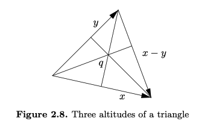

# Chapter 2 Euclidean Space

## 2.1 Algebra: Vectors

### Theorem 2.1.1 (Vector space axioms).

(A1) Addition is associative

(A2) 0 is an additive identity

(A3) Existence of additive inverses

(A4) Addition is commutative

(M1) Scalar multiplication is associative

(M2) 1 is a multiplicative identity

(D1) Scalar multiplication distributes over scalar addition

(D2) Scalar multiplication distributes over vector addition

*For $n > 1$, $\mathbb{R}^n$ is not endowed with vector-by-vector multiplication.*

If the vector space axioms are satisfied with $V$ and $F$ replacing $\mathbb{R}^n$
and $\mathbb{R}$ then we say that $V$ is a vector space over $F$.

We can use intrinsic vector algebra to prove a result from Euclidean geometry, 
that the three medians of a triangle intersect.

Let

$$
p = \frac{x + y + z}{3}
$$

Rewrite it as

$$ 
p = x + \frac{2}{3}(\frac{y+z}{2} - x)
$$

Note that $\frac{y+z}{2}$ is the middle point of $yz$. Then $\frac{y+z}{2} - x$
is the median from $x$ to $yz$, so $p$ is on the median.

Since $x,y,z$ are symmetric, then $p$ is on all 3 medians.

$\square$

The standard basis of $\mathbb{R}^n$ is the set of vectors

$$ 
e_1 = (1, 0, \cdots 0) \\
e_2 = (0, 1, \cdots 0) \\
\cdots \\
e_n = (0, 0, \cdots 1) \\
$$

So

$$
\tag{2.1}
x = \sum_{i = 1}^{n}x_i e_i
$$

### Definition 2.1.2 (Basis).

A set of vectors $\{f_i\}$ is a basis of $\mathbb{R}^n$ if every
$x ∈ \mathbb{R}^n$ is uniquely expressible as a linear combination of the $f_i$.

$\square$

## 2.2 Geometry: Length and Angle

### Definition 2.2.1 (Inner product).

The inner product is a function from pairs of vectors to scalars,

$$ 
\left\langle , \right\rangle 
: \mathbb{R}^n \times \mathbb{R}^n \rightarrow  \mathbb{R}
$$

defined by the formula

$$ 
\left\langle 
(x_1, \cdots, x_n)
,
(y_1, \cdots, y_n)
\right\rangle 
=
\sum_{i = 1}^{n} x_i y_i
$$

### Proposition 2.2.2 (Inner product properties).

(IP1) The inner product is positive definite:
$⟨x,x⟩ ≥ 0$ for all $x ∈ \mathbb{R}^n$, with
equality if and only if $x = 0$.

(IP2) The inner product is symmetric:
$⟨x,y⟩= ⟨y,x⟩$ for all $x,y ∈ \mathbb{R}^n$

(IP3) The inner product is bilinear:

$$ 
⟨x+x',y⟩ = ⟨x,y⟩ + ⟨x',y⟩, \quad ⟨ax,y⟩ = a ⟨x,y⟩ \\
⟨x,y+y'⟩ = ⟨x,y⟩ + ⟨x,y'⟩, \quad ⟨x,by⟩ = b ⟨x,y⟩
$$

for all $a,b ∈ \mathbb{R}$, $x,x',y,y' ∈ \mathbb{R}^n$.

$\square$

>  Like the vector space axioms, the inner product properties are 
> phrased intrinsically, although they need to be proved using 
> coordinates. As mentioned in the previous section,intrinsic 
> methods are neater and more conceptual than
> using coordinates. More importantly:

> *The rest of the results of this section are proved by reference 
> to the inner product properties, with no further reference to 
> the inner product formula.*

### Definition 2.2.3 (Modulus).

The modulus (or absolute value) of a vector $x ∈ \mathbb{R}^n$ is 
defined as

$$
|x| = \sqrt[]{⟨x,x⟩}.
$$

### Proposition 2.2.4 (Modulus properties).

(Mod1) The modulus is positive: $|x| ≥ 0$ for all $x ∈ \mathbb{R}^n$, with equality if and only if $x = 0$.

(Mod2) The modulus is absolute-homogeneous: $|ax|= |a||x|$ for all 
$a ∈ R$ and $x ∈ \mathbb{R}^n$.

### Theorem 2.2.5 (Cauchy–Schwarz inequality).

For all $x,y ∈ \mathbb{R}^n$,

$$ 
|⟨x,y⟩| \leq |x| |y|
$$

with equality if and only if one of $x, y$ is a scalar multiple of 
the other.

> Note that the absolute value signs mean different things on each 
  side of the Cauchy–Schwarz inequality. On the left side, the 
  quantities $x$ and $y$ are vectors, their inner product $⟨x,y⟩$ 
  is a scalar, and $|⟨x,y⟩|$ is its scalar absolute value, while 
  on the right side, $|x|$ and $|y|$ are the scalar absolute 
  values of vectors, and $|x||y|$ is their product. That is, the 
  Cauchy–Schwarz inequality says:

> *The size of the product is at most the product of the sizes.*

> The computation draws on the minutiae of the formulas for the 
inner product and the modulus, rather than using their properties. 
It is uninformative, making the Cauchy–Schwarz inequality look 
like a low-level accident. It suggests that larger-scale 
mathematics is just a matter of bigger and bigger formulas. To
prove the inequality in a way that is enlightening and general, we 
should work intrinsically, keeping the scalars
$⟨x,y⟩$ and $|x|$ and $|y|$ notated in their concise forms, and we 
should use properties, not formulas.

**Proof**.
The result is clear when $x = 0$, so assume $x \neq 0$. For every $a ∈ \mathbb{R}^n$,

$$ 
\begin{split}
0 &\leq ⟨ax-y,ax-y⟩ \quad \\
& \quad \text{by positive definiteness} \\
&= a⟨x,ax-y⟩ - ⟨y,ax-y⟩ \\
& \quad \text{by linearity in the first variable} \\
&= a^2 ⟨x,x⟩ - a ⟨x,y⟩ - a ⟨y,x⟩ + ⟨y,y⟩ \\
& \quad \text{by linearity in the second variable} \\
&= a^2 |x|^2 - 2a ⟨x,y⟩ + |y|^2 \\
& \quad \text{by symmetry, definition of modulus.}
\end{split}
$$

Define

$$ 
f(a) = a^2 |x|^2 - 2a ⟨x,y⟩ + |y|^2
$$

Since $f(a)$ is always nonnegative, so $f$ has at most one root.
Thus by the quadratic formula its discriminant is nonpositive,

$$
4⟨x,y⟩^2 −4|x|^2|y|^2 ≤ 0
$$

So

$$ 
|⟨x,y⟩| \leq |x| |y|
$$

Equality holds exactly when the quadratic polynomial
$f(a) = |ax− y|^2$ has a root a, i.e., exactly when
$y= ax$ for some $a ∈ \mathbb{R}^n$.

$\square$

### Theorem 2.2.6 (Triangle inequality).

For all $x,y ∈ \mathbb{R}^n$,

$$ 
|x+y| \leq |x| + |y|,
$$

with equality if and only if one of $x, y$ is a nonnegative scalar 
multiple of the other.

**Proof**:

$$
\begin{split}
⟨x+y,x+y⟩ \\
&= ⟨x,x+y⟩ + ⟨y,x+y⟩ \\
&= ⟨x,x⟩ + ⟨x,y⟩ + ⟨y,x⟩ + ⟨y,y⟩ \\
&= ⟨x,x⟩ + 2⟨x,y⟩ + ⟨y,y⟩ \\
&\leq  ⟨x,x⟩ + 2|x||y| + ⟨y,y⟩ \\
& \quad \text{by Cauchy–Schwarz} \\
&= (|x| + |y|)^2
\end{split}
$$

Equality holds exactly when $⟨x,y⟩= |x||y|$, or
equivalently when $|⟨x,y⟩|= |x||y|$ and $⟨x,y⟩ ≥ 0$.
These hold when one of $x, y$ is a
scalar multiple of the other and the scalar is nonnegative.

$\square$

* While the Cauchy–Schwarz inequality says that the size of the 
  product is at most the product of the sizes, the triangle 
  inequality says:

> *The size of the sum is at most the sum of the sizes.*

### Proposition 2.2.7 (Size bounds).

For every $j ∈ \{1,...,n\}$,

$$ 
|x_j| \leq |x| \leq \sum_{i=1}^{n} |x_i|.
$$

### Distance Definition

The modulus gives rise to a distance function on Rn that behaves as distance should. Define

$$ 
d: \mathbb{R}^n \times \mathbb{R}^n \xrightarrow{} \mathbb{R}
$$

by

$$ 
d(x,y) = |y-x|
$$

### Theorem 2.2.8 (Distance properties).

(D1) Distance is positive: $d(x,y) ≥ 0$ for all $x,y ∈ \mathbb{R}^n$, and $d(x,y) = 0$ if and only if $x = y$.

(D2) Distance is symmetric: $d(x,y) = d(y,x)$ for all
$x,y ∈ \mathbb{R}^n$.

(D3) Triangle inequality: $d(x,z) ≤ d(x,y)+d(y,z)$ for all
$x,y,z ∈ \mathbb{R}^n$.

### Angle Definition

If $x$ and $y$ are nonzero vectors
in $\mathbb{R}^n$, define their angle $θ_{x,y}$ by the condition

$$
\tag{2.2}
\cos θ_{x,y} =
\frac{⟨x,y⟩}{|x||y|},
\quad
0 \leq θ_{x,y} \leq π.
$$

In particular, two nonzero vectors $x$ and $y$ are orthogonal
when $⟨x,y⟩ = 0$. Thus $0$ orthogonal to all vectors.

### three altitudes must meet

We have

$$
q-y \perp x
\quad
\text{and}
\quad
q-x \perp y
$$

And we want to show

$$
\left\{ 
\begin{array}{lr}
⟨q-y,x⟩ = 0 \\
⟨q-x,y⟩ = 0 \\
\end{array}
\right\} 
\Longrightarrow
⟨q,x-y⟩ = 0
$$

We have

$$ 
\left\{ 
\begin{array}{lr}
⟨q,x⟩ - ⟨y,x⟩ = 0 \\
⟨q,y⟩ - ⟨x,y⟩ = 0 \\
\end{array}
\right\} 
\Longrightarrow
⟨q,x-y⟩ = 0
$$

So we have

$$ 
⟨q,x⟩ = ⟨y,x⟩ = ⟨x,y⟩ = ⟨q,y⟩ \\
\Longrightarrow \\
⟨q,x-y⟩ = 0
$$

$\square$

